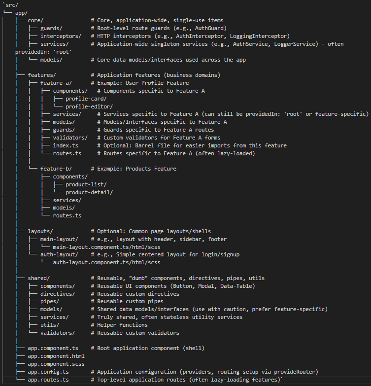

# GoLinguageAdminClientWeb

This project was generated using [Angular CLI](https://github.com/angular/angular-cli) version 19.2.5.

## Development server

To start a local development server, run:

```bash
ng serve
```

Once the server is running, open your browser and navigate to `http://localhost:4200/`. The application will automatically reload whenever you modify any of the source files.


## Project structure

This is where the feature-first approach shines, especially with standalone components:



**Explanation and Best Practices:**

1. **core/**:
    - **Purpose:** Contains code essential for the application's startup and core functionality that is typically instantiated *once*. Think authentication services, logging, HTTP interceptors, root-level guards.
    - **Standalone Context:** Services are usually providedIn: 'root'. Guards and interceptors are registered globally in app.config.ts. Avoid putting components here unless it's a truly unique, app-wide singleton element not part of a layout.
2. **features/**:
    - **Purpose:** This is the heart of the structure. Each sub-directory represents a distinct business domain or feature of your application (e.g., users, products, orders, settings).
    - **High Cohesion:** All files related to a specific feature (components, services, models, routes) live together. This makes features easy to find, understand, develop, and potentially remove or modify in isolation.
    - **Standalone Context:**
        - Feature routes (features/feature-a/routes.ts) typically define routes loading the feature's standalone components.
        - These routes are lazy-loaded from app.routes.ts using loadChildren or loadComponent.
        - Components within a feature are standalone and import dependencies directly (like shared components or other standalone components).
        - Feature-specific services can be providedIn: 'root' if globally needed, or provided specifically at the feature's route level in routes.ts if their lifecycle should be tied to the feature.
3. **layouts/ (Optional but Recommended for larger apps)**:
    - **Purpose:** Holds different page layout structures (e.g., one for logged-in users with navigation, one for authentication pages).
    - **Standalone Context:** Layout components are standalone. Routes in app.routes.ts or feature routes will use these layout components, often wrapping child routes displayed within an <router-outlet> inside the layout.
4. **shared/**:
    - **Purpose:** Contains reusable code that is *not* specific to any single feature and is presentation-focused or a utility. Think UI components (buttons, modals), directives (custom styling/behavior), pipes (data formatting), utility functions.
    - **Key Rule:** Shared code should *not* depend on any specific feature. Features can depend on shared, but not vice-versa.
    - **Standalone Context:** All components, directives, and pipes here are standalone. They are simply imported directly into the imports: [] array of any feature component (or other shared component) that needs them. No more SharedModule needed for imports/exports.
5. **app.config.ts & app.routes.ts**:
    - **app.config.ts**: Centralizes application-wide providers using provide* functions (e.g., provideRouter, provideHttpClient(withInterceptors(...)), provideStore for NgRx, etc.). This replaces the providers array of the old AppModule.
    - **app.routes.ts**: Defines the top-level routing hierarchy. Crucially, this is where you set up lazy loading for your feature routes using loadComponent (for single component routes) or loadChildren (for route config files like features/feature-a/routes.ts).